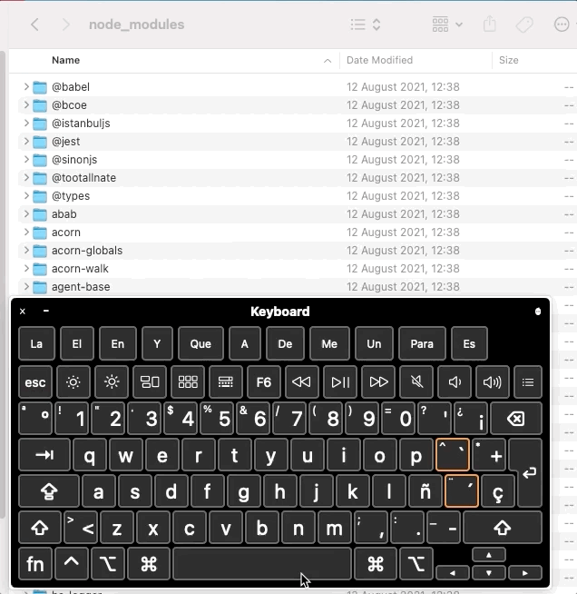
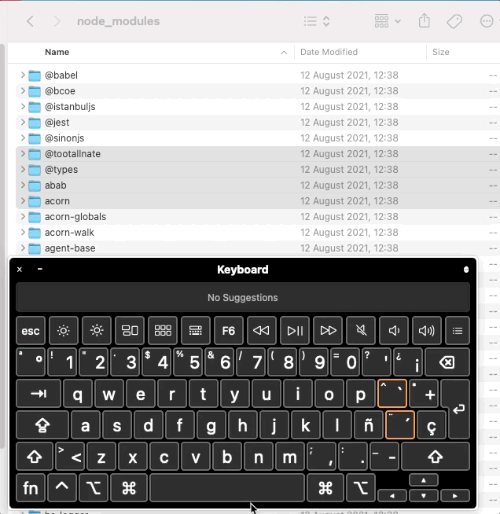
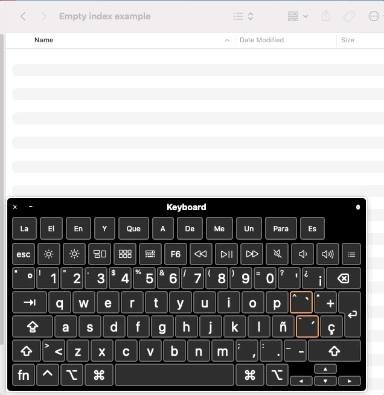
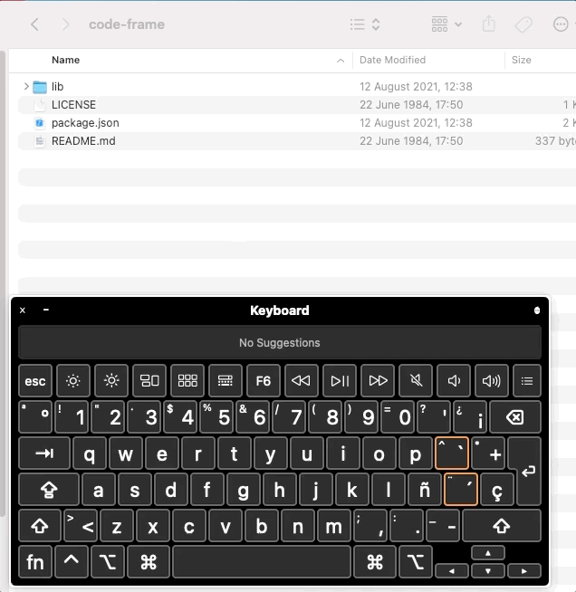
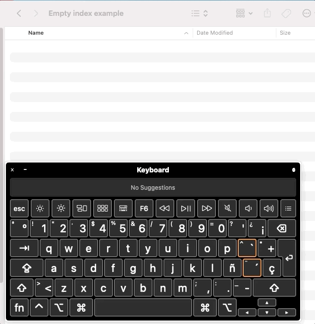
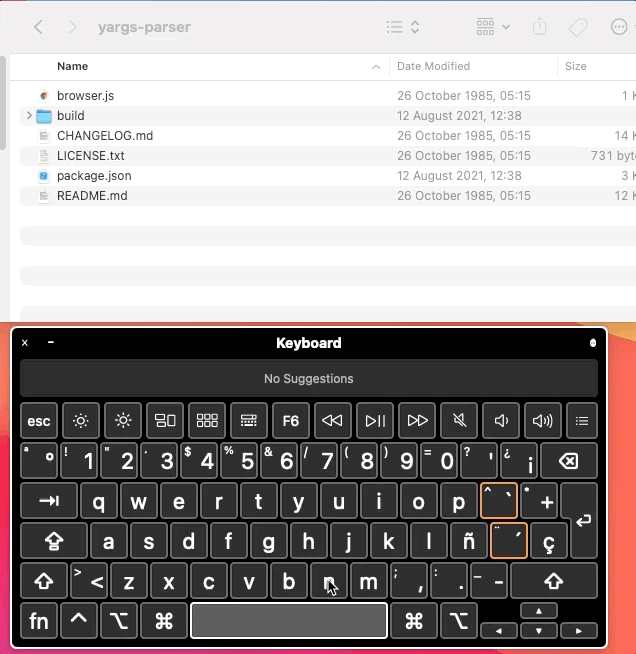
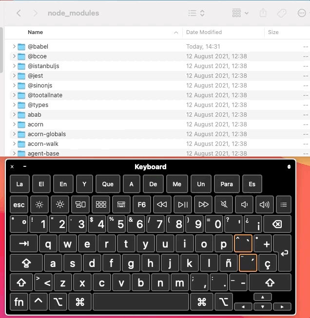

# Select One Key

## Scenarios
### Should be able to select one key in a non empty list

|  |  |
| --- | ---|
| Implemented | ✅ |
| Has tests | ✅ |
| Hot Key | `click` |

### If another `Select One Key` if performed over a non-selected key, the previous is deselected

|  |  |
| --- | ---|
| Implemented | ✅ |
| Has tests | ✅ |
| Hot Key | `click` |

### Should do nothing if selecting an already selected key
|  |  |
| --- | ---|
| Implemented | ❌ |
| Has tests | ❌ |
| Hot Key | `click` |
| Issue | https://github.com/codingedgar/macos-multi-select/issues/26 |

# Toggle Key Selection

## Scenarios
### Should be able to add and remove a selection one key in a non empty index

|  |  |
| --- | ---|
| Implemented | ✅ |
| Has tests | ✅ |
| Hot Key | `⌘ + click` |

# Select Adjacent Keys

## Scenarios
### Should select from top to bottom in an empty list
|  |  |
| --- | ---|
| Implemented | ✅ |
| Has tests | ✅ |
| Hot Key | `⇧ + click` |

### Should select from the last adjacent pivot
|  |  |
| --- | ---|
| Implemented | ✅ |
| Has tests | ✅ |
| Hot Key | `⇧ + click` |

### Should perform a minus between the old and new `start key` adjacent key selections
|  |  |
| --- | ---|
| Implemented | ✅ |
| Has tests | ✅ |
| Hot Key | `⇧ + click` |

### Should perform a minus between the old and new `end key` adjacent key selections

|  |  |
| --- | ---|
| Implemented | ❌ |
| Has tests | ❌ |
| Hot Key | `⇧ + click` |
| Issue | https://github.com/codingedgar/macos-multi-select/issues/17 |

### Should find pivot in next selection even when pivot is in the initial state due to select adjacent on initial state

|  |  |
| --- | ---|
| Implemented | ✅ |
| Has tests | ✅ |
| Hot Key | `⇧ + click` |

### Find pivot in bottom selection
|  |  |
| --- | ---|
| Implemented | ✅ |
| Has tests | ✅ |
| Hot Key | `⇧ + click` |

### Find pivot in top selection
|  |  |
| --- | ---|
| Implemented | ✅ |
| Has tests | ✅ |
| Hot Key | `⇧ + click` |

# Deselect all

## Scenarios
### Deselect All
|  |  |
| --- | ---|
| Implemented | ✅ |
| Has tests | ✅ |
| Hot Key | `⌘ + ⌥ + A` (Command + Alt + A) |

# Select Next
# Scenarios
### Should do nothing if no keys
|  |  |
| --- | ---|
| Implemented | ✅ |
| Has tests | ✅ |
| Hot Key | `Arrow Down` |

### Should start from the top

|  |  |
| --- | ---|
| Implemented | ✅ |
| Has tests | ✅ |
| Hot Key | `Arrow Down` |

### Should never select beyond last key

|  |  |
| --- | ---|
| Implemented | ✅ |
| Has tests | ✅ |
| Hot Key | `Arrow Down` |

### Should select next key from the last `Select Adjacent Key end key` not the `Select Adjacent Key start key`

|  |  |
| --- | ---|
| Implemented | ✅ |
| Has tests | ✅ |
| Hot Key | `Arrow Down` |

### Should select next from the last selected even when the selection is bottom to top

|  |  |
| --- | ---|
| Implemented | ✅ |
| Has tests | ✅ |
| Hot Key | `Arrow Down` |

# Select Previous Key
## Scenarios
### Should do nothing if the list is empty

|  |  |
| --- | ---|
| Implemented | ✅ |
| Has tests | ✅ |
| Hot Key | `Arrow Up` |

### Should start from the bottom

|  |  |
| --- | ---|
| Implemented | ✅ |
| Has tests | ✅ |
| Hot Key | `Arrow Up` |

### Should never select beyond first key

|  |  |
| --- | ---|
| Implemented | ✅ |
| Has tests | ✅ |
| Hot Key | `Arrow Up` |

### Should select next key from the last `Select Adjacent Key end key` not the `Select Adjacent Key start key`

|  |  |
| --- | ---|
| Implemented | ✅ |
| Has tests | ✅ |
| Hot Key | `Arrow Up` |

### Should select previous from the last selected even when the selection is bottom to top

|  |  |
| --- | ---|
| Implemented | ✅ |
| Has tests | ✅ |
| Hot Key | `Arrow Up` |

# Select Next Adjacent Key
### Scenarios
## Should start from top
## `Adjacent range` union
# Select Previous Adjacent Key
### Scenarios
## Should start from bottom
## `Adjacent range` union

# Changes in Index
## Scenarios
### Key added to the index in `Adjacent Range`
### Key added outside of `Adjacent Range`
### Non-selected Key removed from the index
