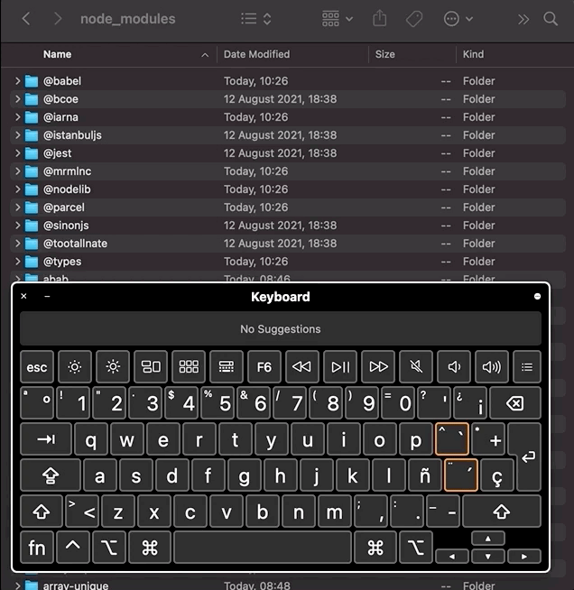

# Table of content
- [Select One Key](#select-one-key)
- [Toggle Key Selection](#toggle-key-selection)
- [Select Adjacent Keys](#select-adjacent-keys)
- [Deselect All](#deselect-all)
- [Select Next Key](#select-next-key)
- [Select Previous Key](#select-previous-key)
- [Select Next Adjacent Key](#select-next-adjacent-key)
- [Select Previous Adjacent Key](#select-previous-adjacent-key)
- [Changes in Index](#changes-in-index)

# Select One Key

## Properties
### Should be able to select one key in a non empty list

|  |  |
| --- | ---|
| Implemented | ✅ |
| Has tests | ✅ |
| Hot Key | `click` |

### If another `Select One Key` if performed over a non-selected key, the previous is deselected

|  |  |
| --- | ---|
| Implemented | ✅ |
| Has tests | ✅ |
| Hot Key | `click` |

### Should deselect all but the selected key
|  |  |
| --- | ---|
| Implemented | ✅ |
| Has tests | ✅ |
| Hot Key | `click` |
| Issue | https://github.com/codingedgar/macos-multi-select/issues/26 |

# Toggle Key Selection

## Properties
### Should be able to add and remove a selection one key in a non empty index

|  |  |
| --- | ---|
| Implemented | ✅ |
| Has tests | ✅ |
| Hot Key | `⌘ + click` |

# Select Adjacent Keys

## Properties
### Should select from top to bottom in an empty list
|  |  |
| --- | ---|
| Implemented | ✅ |
| Has tests | ✅ |
| Hot Key | `⇧ + click` |

### Should select from the last adjacent pivot
|  |  |
| --- | ---|
| Implemented | ✅ |
| Has tests | ✅ |
| Hot Key | `⇧ + click` |

### Should perform a minus between the old and new `start key` adjacent key selections
|  |  |
| --- | ---|
| Implemented | ✅ |
| Has tests | ✅ |
| Hot Key | `⇧ + click` |

### Should perform a minus between the old and new `end key` adjacent key selections

|  |  |
| --- | ---|
| Implemented | ✅ |
| Has tests | ✅ |
| Hot Key | `⇧ + click` |
| Issue | https://github.com/codingedgar/macos-multi-select/issues/17 |

### Should find pivot in next selection even when pivot is in the initial state due to select adjacent on initial state

|  |  |
| --- | ---|
| Implemented | ✅ |
| Has tests | ✅ |
| Hot Key | `⇧ + click` |

### Find pivot in bottom selection
|  |  |
| --- | ---|
| Implemented | ✅ |
| Has tests | ✅ |
| Hot Key | `⇧ + click` |

### Find pivot in top selection
|  |  |
| --- | ---|
| Implemented | ✅ |
| Has tests | ✅ |
| Hot Key | `⇧ + click` |

# Deselect All

## Properties
### Deselect All
|  |  |
| --- | ---|
| Implemented | ✅ |
| Has tests | ✅ |
| Hot Key | `⌘ + ⌥ + A` (Command + Alt + A) |

# Select Next Key
## Properties
### Should do nothing if no keys
|  |  |
| --- | ---|
| Implemented | ✅ |
| Has tests | ✅ |
| Hot Key | `Arrow Down` |

### Should start from the top

|  |  |
| --- | ---|
| Implemented | ✅ |
| Has tests | ✅ |
| Hot Key | `Arrow Down` |

### Should never select beyond last key

|  |  |
| --- | ---|
| Implemented | ✅ |
| Has tests | ✅ |
| Hot Key | `Arrow Down` |

### Should select next key from the last `Select Adjacent Key end key` not the `Select Adjacent Key start key`

|  |  |
| --- | ---|
| Implemented | ✅ |
| Has tests | ✅ |
| Hot Key | `Arrow Down` |

### Should select next from the last selected even when the selection is bottom to top

|  |  |
| --- | ---|
| Implemented | ✅ |
| Has tests | ✅ |
| Hot Key | `Arrow Down` |

# Select Previous Key
## Properties
### Should do nothing if the list is empty

|  |  |
| --- | ---|
| Implemented | ✅ |
| Has tests | ✅ |
| Hot Key | `Arrow Up` |

### Should start from the bottom

|  |  |
| --- | ---|
| Implemented | ✅ |
| Has tests | ✅ |
| Hot Key | `Arrow Up` |

### Should never select beyond first key

|  |  |
| --- | ---|
| Implemented | ✅ |
| Has tests | ✅ |
| Hot Key | `Arrow Up` |

### Should select next key from the last `Select Adjacent Key end key` not the `Select Adjacent Key start key`

|  |  |
| --- | ---|
| Implemented | ✅ |
| Has tests | ✅ |
| Hot Key | `Arrow Up` |

### Should select previous from the last selected even when the selection is bottom to top

|  |  |
| --- | ---|
| Implemented | ✅ |
| Has tests | ✅ |
| Hot Key | `Arrow Up` |

# Select Next Adjacent Key
## Properties
### In the initial state the user starts from the top
|  |  |
| --- | ---|
| Implemented | ✅ |
| Has tests | ✅ |

### When the last selected group is ascending then it selects the next key
|  |  |
| --- | ---|
| Implemented | ✅ |
| Has tests | ✅ |
| Hot Key | `Shift ⇧ + Arrow Down` |

### When the selected group is ascending then it deselects the next key
|  |  |
| --- | ---|
| Implemented | ✅ |
| Has tests | ✅ |
| Hot Key | `Shift ⇧ + Arrow Down` |

### Ignores the adjacent pivot key (adjacent pivot is always selected)

|  |  |
| --- | ---|
| Implemented | ❌ |
| Has tests | ❌ |
| Hot Key | `Shift ⇧ + Arrow Down` |

### Adjacent group union
If the next element to select has an adjacent group of selected keys, it does an union of that group, and orders it as if it were selected with a `Select Next Adjacent Key` command (sequentially instead of the original order of selection).

|  |  |
| --- | ---|
| Implemented | ❌ |
| Has tests | ❌ |
| Hot Key | `Shift ⇧ + Arrow Down` |

# Select Previous Adjacent Key
## Properties
## Should start from bottom
## `Adjacent group` union

# Changes in Index
## Properties
### Key added to the index in `Adjacent Range`
### Key added outside of `Adjacent Range`
### Non-selected Key removed from the index
